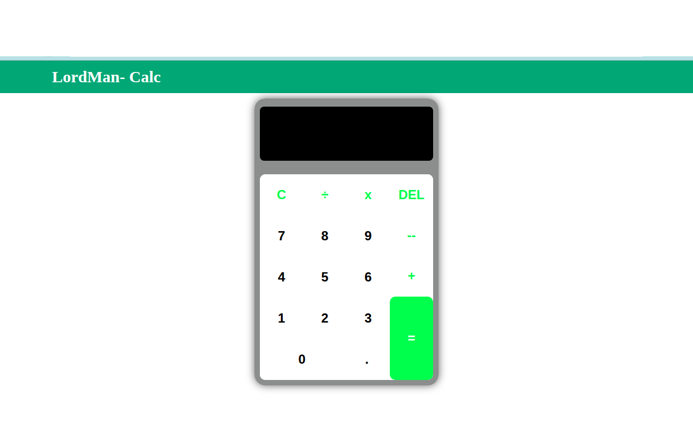

# calculator

This project is to build a simple calculator using HTML, CSS, and JavaScript. This performs basic arithmetic operations and runs entirely in your browser.

## Preview

## Features

- Addition(+)
- Substraction(-)
- Multiplication(×)
- Division(÷)
- Clear and Delete functions

## Built with 

- HTML 
- CSS
- JavaScript
